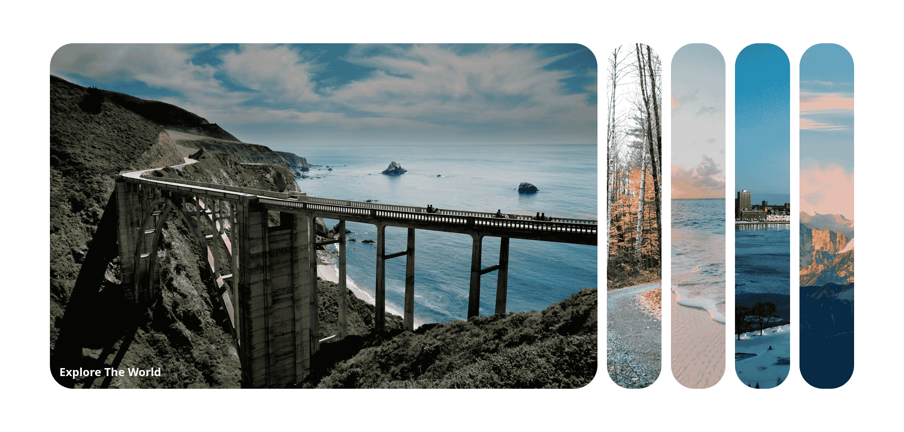
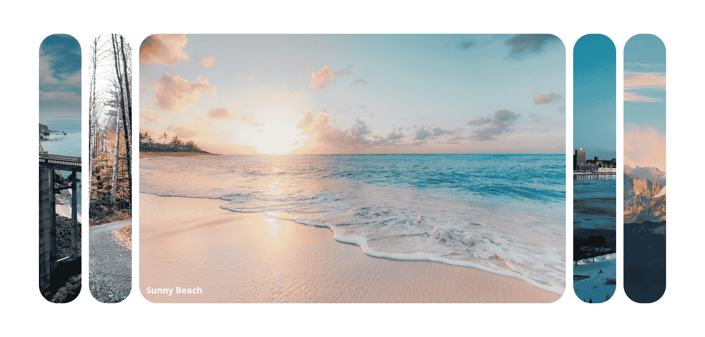
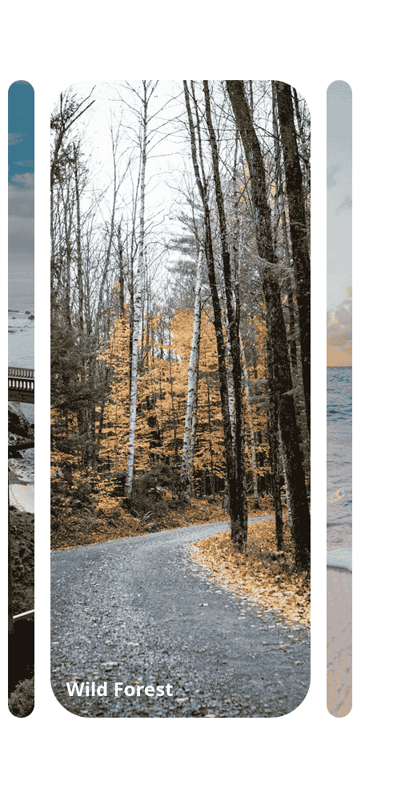

# Day 01

## What I created

An interactive album for images of beautiful places

## Screenshots





## What I learned

- Responsive design (for smaller screens)
- Transitions
  - `transition: opacity 0.3s ease-in 0.4`
- Opacity property
- `cursor: pointer`
- Background image properties

  - ```css
    background-size: cover;
    background-position: center;
    background-repeat: no-repeat;
    ```

- using `forEach` on `NodeList`
- `relative` on parent and `absolute` on child
- `overflow: hidden` property so that we don't get a scrollbar
