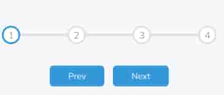
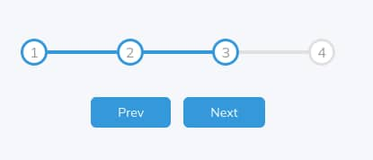

# Day 02

## What I created

A progress scroll bar to track progress for wizards, quizzes, or payment

## Screenshots

## What I learned

- `::before` pseude-element still renders inside the element that it references, only before any content it has inside, and it's inline by default
- `z-index`
  - has default value `auto`
  - only works on positioned elements (`position: absolute, position: relative, position: fixed, position: sticky`)
- To center text inside a circle, we do `align-items: center; justify-content: center;`
- the `:root` is called a scope, and it's used to define custom properties
- Properties like `color`, `font-family`, and `font-size` are inherited by default.
- The `inherit` keyword can be explicitly applied to any property to force it to inherit its values from its direct parent, overriding its default behavior or any other conflicting rules
- `input`, `select`, `textarea` `button` - do not inherit by default but you can set it to inherit with css
- Muli font is renamed to Mulish on google fonts
- The `:active` pseudo-class in CSS represents an element while it is being "activated" by the user. this state typically occurs when a user clicks and holds down the primary mouse button on an element, or when an element is otherwise triggered, such as through keyboard interaction or touch events on a touchscreen.
- You can also target `:disabled` and `:focus` on buttons
- You can use the `cursor: not-allowed` property to change the pointer to a not allowed cursor
