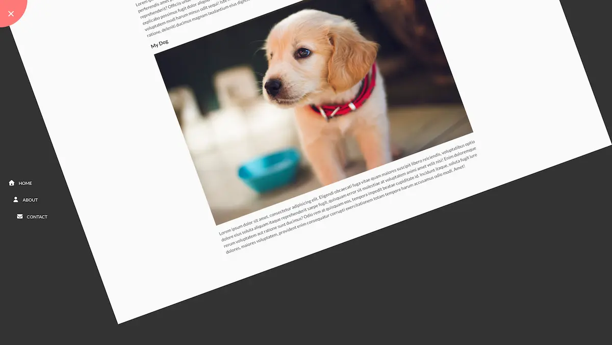
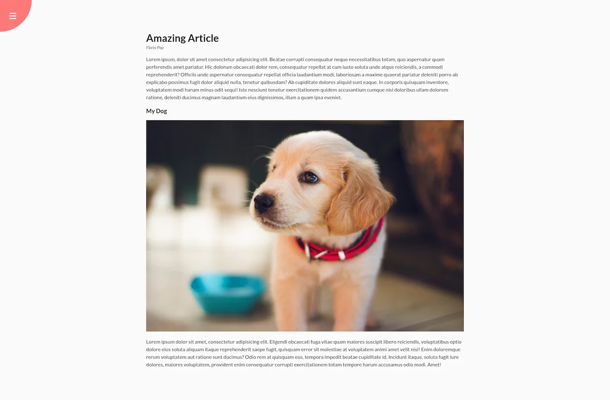
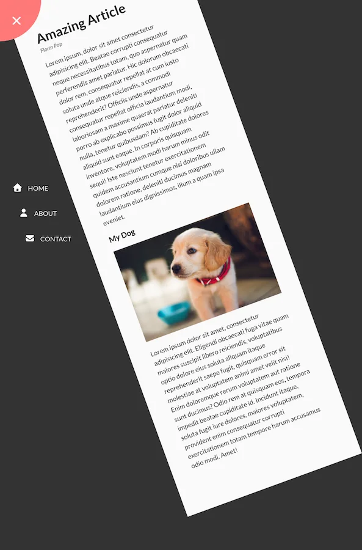

# Day 03

## What I created

A navigation bar that rotates from the side of the screen when you show it

## Screenshots





## What I learned

- `small` tag
- `transform-origin: top left;`
- don't forget the s unit in transition or it will give invalid property value error in the browser
- If you have a fixed div that you want the children to position relative to it, have the children contained in another div that's positioned relative inside the parent div
- Playing with class selectors and the `+` selectors we get

  - Conditional styles

    - ```css
      .container.show-nav {
        transform: rotate(-20deg);
      }
      ```

  - Selecting only certain elements
    - `nav ul li + li`: only from 2nd element
    - `nav ul li + li + li`: only from 3rd element
    - `container.show-nav + nav li`: choose the `nav li` and apply style when `show-nav` is applied
