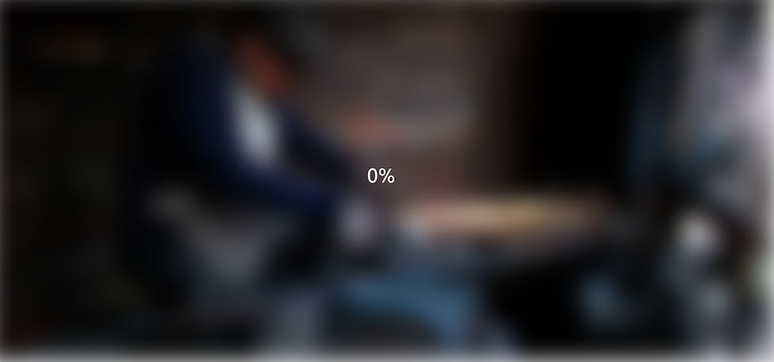

# Day 05

## What I created

A blurry loading effect before loading some content

## Screenshots




## What I learned

- ### `background` property

  - `url` then values `no-repeat center center/cover`
    - Shorthand
    - `background-image: url()`
    - `background-repeat: no-repeat`
    - `background-position: center center`
    - `background-size: cover`
      - could be also the keywords `auto` and `contain`
      - `contain` means to resize the background image so that it's fully visible
      - `cover` means resize the background image to cover the entire container, even if it
        has to stretch the image or cut a little bit off one of the edges

- ### Positioning a background larger than the viewport height and width

  ```css
  top: -30px;
  left: -30px;
  width: calc(100vw + 60px);
  height: calc(100vh + 60px);
  ```

  -because the blurring causes the image to have white edges we need to have the image trimmed and zoomed in a bit to get rid of these white edges

- ### Blurring an element width a filter

  ```css
  fitler: blur(30px);
  ```
