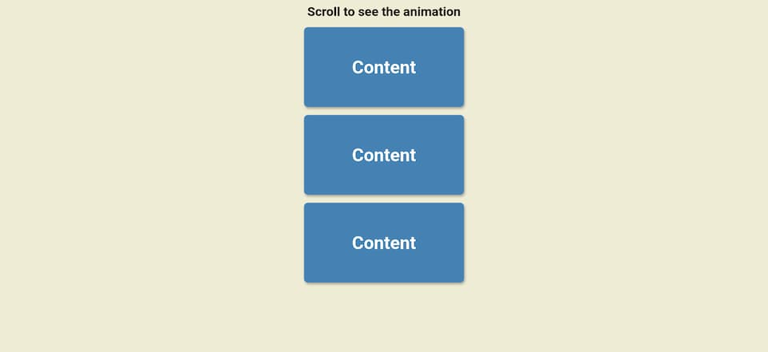
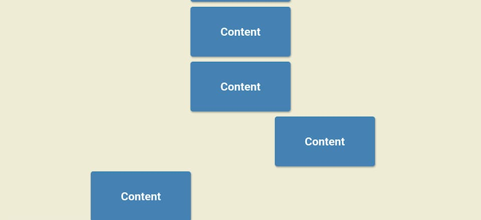

# Day 06

## What I created

Content slides in place when you scroll down to see it

## Screenshots

## What I learned

- `:nth-of-type()` pseudo-class selector that selects elements of the same type
  - Can select based on a pattern
    - Number
    - Formula
      - like `an + b`
    - `even` or `odd`
  - Similar to `nth-child` but only counts elements of the same type
- `getBoundingClientRect`
  - Returns a `DOMRect` providing information about the size of an element and its position relative to the viewport
  - The `left`, `top`, `right`, `bottom`, `x`, `y`, `width`, and `height` properties describe the position and size of the overall rectangle in pixels. Properties other than `width` and `height` are relative to the top-left of the viewport.
  - Different from properties like `offsetTop` since offsetTop doesn't change when you scroll
- If you have the css rule with the selector `nth-of-type(even)` after the `.box.show` rule, then it overrides the `translateX(0)` when the `.box.show` rule is applied, meaning that applying the `show` class won't make the box appear
- `window.innerHeight`: gets the (inner) height of the viewport
