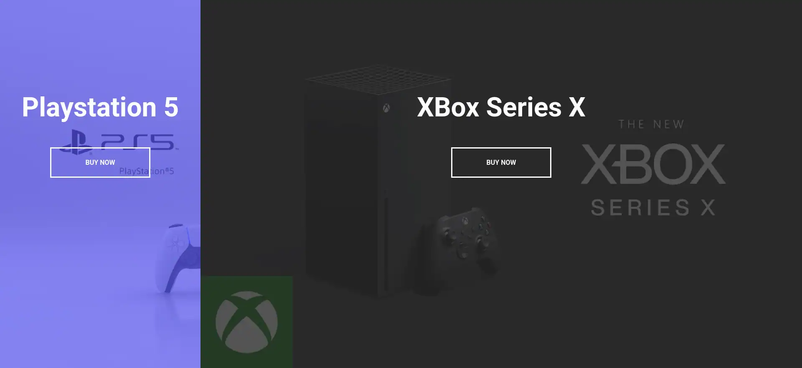
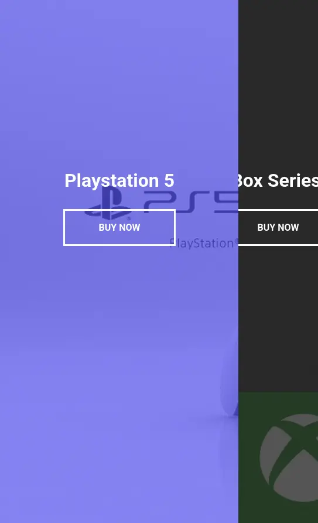

# Day 07

## What I created

A split landing page displaying two products that grow wider when you hover over one of them

## Screenshots

## What I learned

- You can line up two items together with absolute if you want to change the split dynamically without dealing with the complexities of flex box
- If you use `::before` you need to set `content: '';` or some other value
- `white-space: nowrap`
- `mouseenter` event instead of hover is the event for a mouse entering an element
  - Similarly `mouseleave` is for the mouse leaving the element
