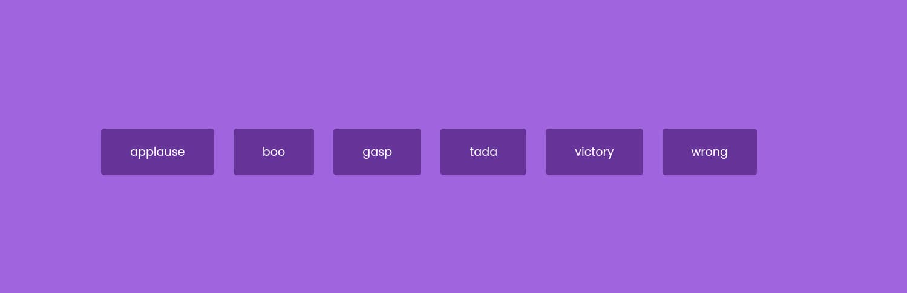

# Day xx

## What I created

An sound board that plays some sample audio clips

## Screenshots

## What I learned

- `<audio>` element
  - `<audio id="applause" src="sounds/applause.mp3"></audio>`
  - you can manually play and pause them or you can use javascript
  - you cannot stop them with javascript, you can set the current time to 0 and pause
