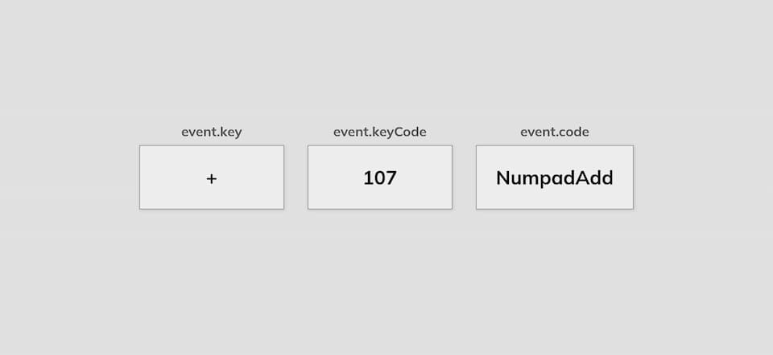

# Day 11

## What I created

Show keycode for a key press event

## Screenshots



## What I learned

- The main difference between `display: flex` and `display: inline-flex` is that `flex` makes the container a block-level element, taking up the full width of its parent, while `inline-flex` makes it an inline element, only taking up the space required by its content. Both allow for flexible layouts of their child elements.
- In order to position some "title" right over a div that's gonna be centered horizontally we can
  - Have it absolutely positioned with top at a negative value
  - Set `width: 100%`
  - Set `text-align: center`
- What key was sent to window?

  ```js
  const insert = document.getElementById("insert");
  window.addEventListener("keydown", (event) => {
    insert.innerHTML = `
        <div class="key">
          ${event.key === " " ? "Space" : event.key}
          <small>event.key</small>
        </div>
  
      <div class="key">
          ${event.keyCode}
        <small>event.keyCode</small>
      </div>
      <div class="key">
          ${event.code}
        <small>event.code</small>
      </div>`;
  });
  ```
