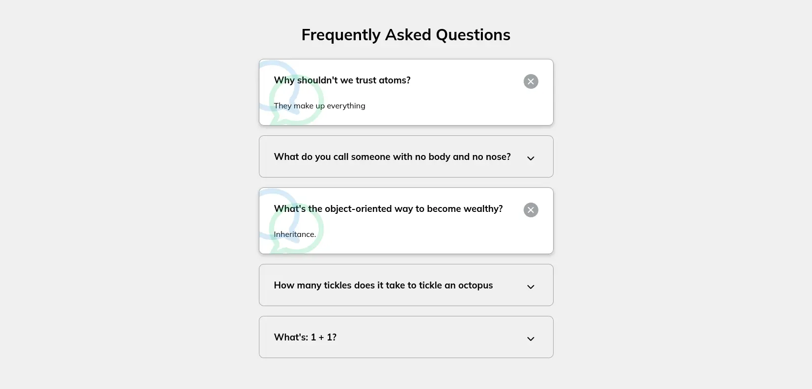

# Day 12

## What I created

FAQ Page

## Screenshots



## What I learned

- You can add a font awesome icon this way

  ```css
  .faq.active::before,
  .faq.active::after {
    content: "\f075";
    font-family: "Font Awesome 5 Free";
    color: #2ecc71;
    font-size: 7rem;
    position: absolute;
    opacity: 0.2;
    top: 20px;
    left: 20px;
    z-index: 0;
  }
  ```

- `classList.toggle()`
  - Saves you from the toggling logic for a css class
