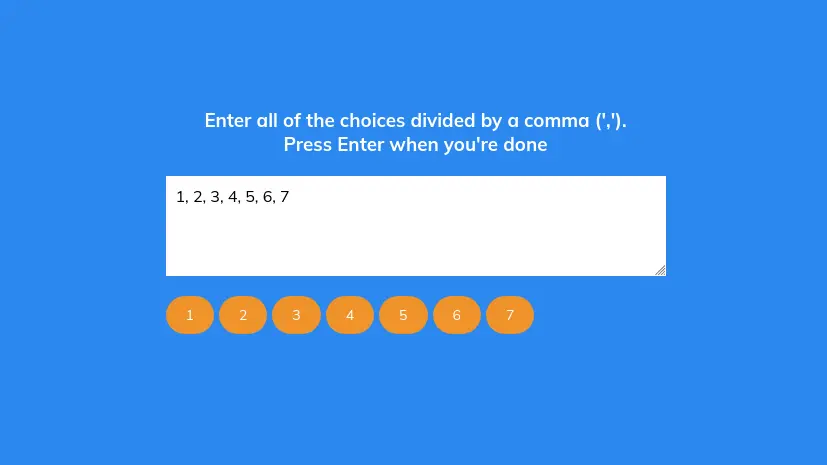
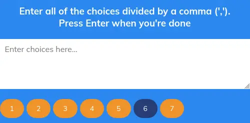

# Day 13

## What I created

Random Choice Picker that random picks one of various choices you specify to the program

## Screenshots




## What I learned

-   `textarea` tag
    -   The `<textarea>` tag in HTML is used to create a multi-line text input field, allowing users to enter and edit larger amounts of text, such as comments or feedback. It can be customized with attributes like `rows` and `cols` to define its size, and it is often used in forms for user input.
-   You can reset the value of an event target this way

    ```js
    createTags(e.target.value);

    if (e.key === 'Enter') {
        setTimeout(() => {
            e.target.value = '';
        }, 10);
        randomSelect();
    }
    ```

    -   However you need to be careful if you want to pass the value to another part of the code, and you need to clear it after a timeout
