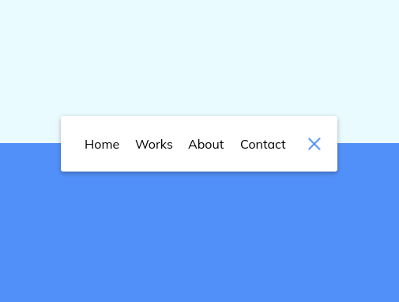
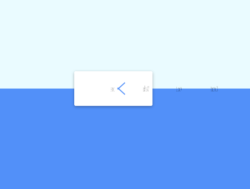
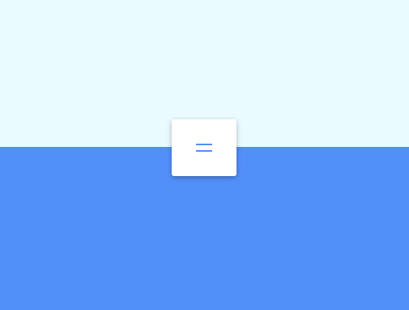

# Day 14

## What I created

A toggle-able navigation bar that has a collapsing/expanding animation

## Screenshots





## What I learned

-   Whenever you want to override the `top` property to its default:
    -   `top: auto`
-   Reset a list's bullet point style
    -   `list-style-type: none`
-   Bi-color background gradient
    ```css
    background-image: linear-gradient(
        to bottom,
        #eafbff 0%,
        #eafbff 50%,
        #5290f9 50%,
        #5290f9 100%
    );
    ```
