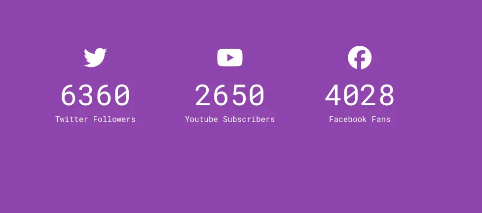
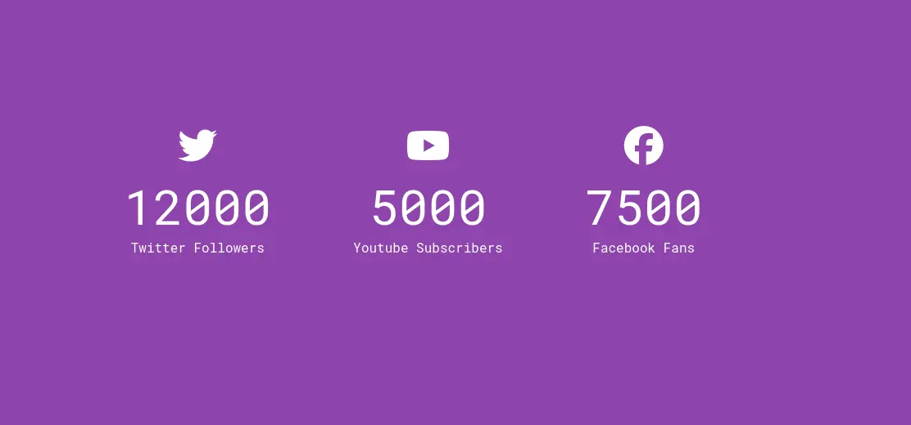

# Day 15

## What I created

A social media number of followers animation widget

## Screenshots

## What I learned

-   Font awesome class for bigger icon
    -   `<i class="fab fa-twitter fa-3x"></i>`
-   To turn a string to a number
    -   use the `+` operator before the string
